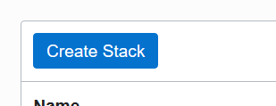
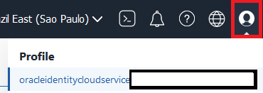
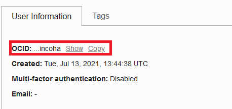
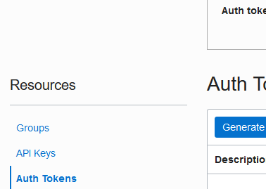
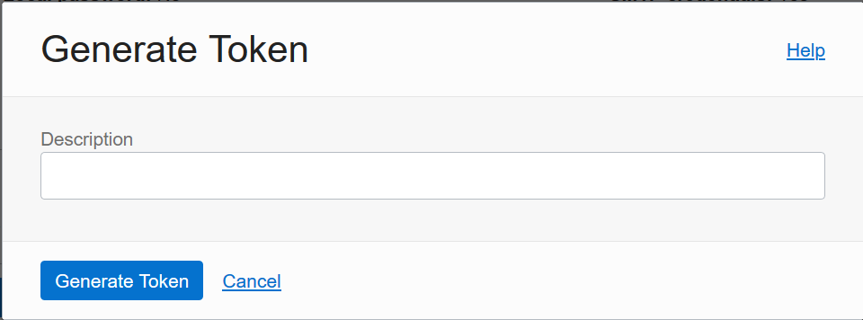
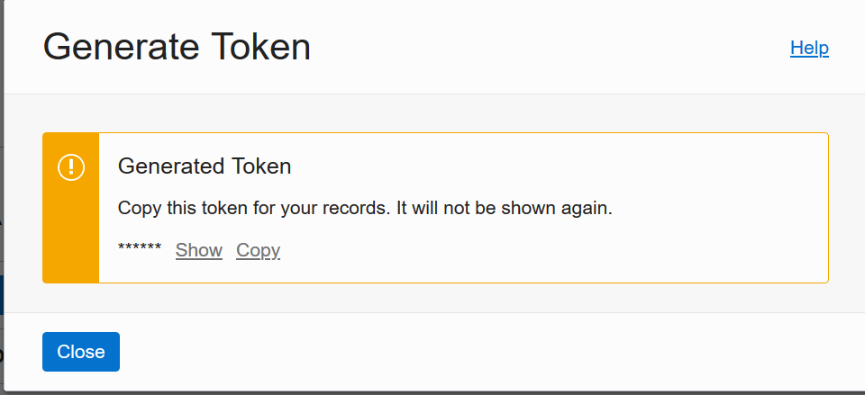


## LAB 01 - PREPARAÇÃO DE AMBIENTE
Nesse laboratório prepararemos a infraestrutura base do workshop, onde criaremos os seguintes serviços:
### Documentação de Referência

- **Compartimento:** Separação lógica de recursos dentro da cloud. O compartimento tem função fundamental no controle de políticas de acesso, governança, e controle de custos dentro da tenancy:[https://docs.oracle.com/pt-br/iaas/Content/Identity/Tasks/managingcompartments.htm](https://docs.oracle.com/pt-br/iaas/Content/Identity/Tasks/managingcompartments.htm)
- **Resource Manager Stack:** Stack de códigos de terraform que serão usados no workshop:[https://docs.oracle.com/pt-br/iaas/Content/ResourceManager/Concepts/resourcemanager.htm](https://docs.oracle.com/pt-br/iaas/Content/ResourceManager/Concepts/resourcemanager.htm)
-  **Dynamic Groups:** Os grupos dinâmicos permitem que você grupo instâncias de computação do Oracle Cloud Infrastructure como atores "principais" (similares aos grupos de usuários):[https://docs.oracle.com/pt-br/iaas/Content/Identity/Tasks/managingdynamicgroups.htm](https://docs.oracle.com/pt-br/iaas/Content/Identity/Tasks/managingdynamicgroups.htm)
-  **Políticas de acesso:**  [https://docs.oracle.com/pt-br/iaas/Content/Identity/Concepts/policygetstarted.htm](https://docs.oracle.com/pt-br/iaas/Content/Identity/Concepts/policygetstarted.htm)
-  **Virtual Cloud Network:** Rede virtual em nuvem.[https://docs.oracle.com/pt-br/iaas/Content/Rover/Network/VCN/vcn_management.htm#VCNManagement](https://docs.oracle.com/pt-br/iaas/Content/Rover/Network/VCN/vcn_management.htm#VCNManagement)
-  **Container Engine for Kubernetes:** [https://docs.oracle.com/pt-br/iaas/Content/ContEng/Concepts/contengoverview.htm](https://docs.oracle.com/pt-br/iaas/Content/ContEng/Concepts/contengoverview.htm)
- **Container Registry:** Registro de containers similiar ao Docker Hub.[https://docs.oracle.com/pt-br/iaas/Content/Registry/Concepts/registryoverview.htm](https://docs.oracle.com/pt-br/iaas/Content/Registry/Concepts/registryoverview.htm)
- **Cloud Shell:** [https://docs.oracle.com/en-us/iaas/Content/API/Concepts/cloudshellintro.htm](https://docs.oracle.com/en-us/iaas/Content/API/Concepts/cloudshellintro.htm)

### Criando o  compartimento para o projeto
1. Acesse a console da cloud: [https://www.oracle.com/cloud/sign-in.html](https://www.oracle.com/cloud/sign-in.html)
3. Insira o nome da sua tenancy no campo de **Cloud Account Name**

4. Clique no botão **Continue** para ir para a página de login.

5. Insira seu usuario/senha e clique em **Sing In**

6. Acesse o **menu no canto esquerdo superior**, em **Identidade & Segurança** (Identity & Security), clique em **Compartimentos** (Compartments).

7. Clique em Criar Compartimento (Create Compartment).

8. Preencha os seguintes campos:
-  **Name:** < Defina um nome para o compartimento >
-  **Description:** < Defina uma descrição para o compartimento >
-  **Parent Compartment:** Selecione o compartimento sinalizado como **(root)**

9. Clique em **Create Compartment**
10. Aguarde um breve momento, e atualize a página do navegador para que a mudança seja refletida.

### Criando ambiente base utilizando o Oracle Resource Manager

 11. Acesse o menu no canto esquerdo superior, em **Serviços de Desenvolvimento** (Developer Services), clique em **Pilhas** (Stacks)
 

 12. No canto esquerdo inferior, em **Escopo** (List Scope), selecione o compartimento recém criado. *Se caso o compartimento não estiver listado, basta atualizar a página do navegador*

 13. Faça o [Download](https://github.com/gustavogaspar/devopsworkshopapp/raw/main/terraform.zip) do ".zip" de configuração contendo o manifesto terraform (Não é necessária a extração do arquivo).
 14. Clique em **Criar Pilha** (Create Stack)
 

 15. Preencha o formulário conforme abaixo:
- Selecione **Minha Configuração** (My Configuration)
- Em **Configuração de Pilha** (Stack Configuration), selecione **Arquivo .zip** e faça o upload do .zip de configuração coletado no passo **14** deste guide.

16. Clique em **Próximo** (Next)
17. Preencha o formulário com as seguintes informações:

- **Compartment**: Selecione o compartimento criado nesse laboratório
- **Number of Worker Nodes:** 2
- **Select a shape for the Worker Nodes instances**: VM.Standard2.1

18. Clique em **Próximo** (Next)
19. Selecione a checkbox **Run Apply** e clique em **Criar**

20. Enquanto a infraestrutura do laboratório esta sendo gerada siga para o próximo passo.

### Coletando informações necessárias

21. No canto direito superior da console,  selecione o **botão de perfil** e clique em seu **usuário**. (Caso você tenha provisionado sua tenancy para esse laboratório, é possivel que este botão esteja desabilitado, basta deslogar sua conta e logar novamente para que tudo seja carregado corretamente.)

22. Copie a informação de **OCID** para um bloco de notas.

23. No canto esquerdo inferior em **Recursos** (Resources) selecione **Auth Tokens**

24. Selecione **Gerar Token** (Generate Token)

25. Insira uma descrição qualquer para o token

26. Copie a informação do token gerado para o block de notas. (**IMPORTANTE**: não é possivel recuperar essa informação novamente, portanto se caso perder o token, será necessario gerar um token novo).

### Construindo de container de aplicação e enviando ao Oracle Container Registry utilizando Cloud Shell
27. No canto superior direito da console, selecione o icone do **Cloud Shell** ">_".

28. Aguarde o carregamento do Shell, e digite:

    $ git clone https://github.com/gustavogaspar/devopsworkshopapp.git

29. Navegue para pasta do projeto digitando:

    $ cd devopsworkshopapp

30. Execute o script de bash para realizar o build da nossa imagem docker, e o envio para o registro de container:

    $ source ./buildandpush.sh

31. Informe o seu **User OCID**. (Informação coletada no passo 22 desse laboratório)

32. No campo de **Password** Informe o seu **Auth Token**. **IMPORTANTE** não há feedback visual de que a senha está sendo digitada. (Informação coletada no passo 26 desse laboratório)

33. Aguarde a conclusão do processo, e vá ao próximo laboratório.

<------------- [RETORNAR](../Readme.md)